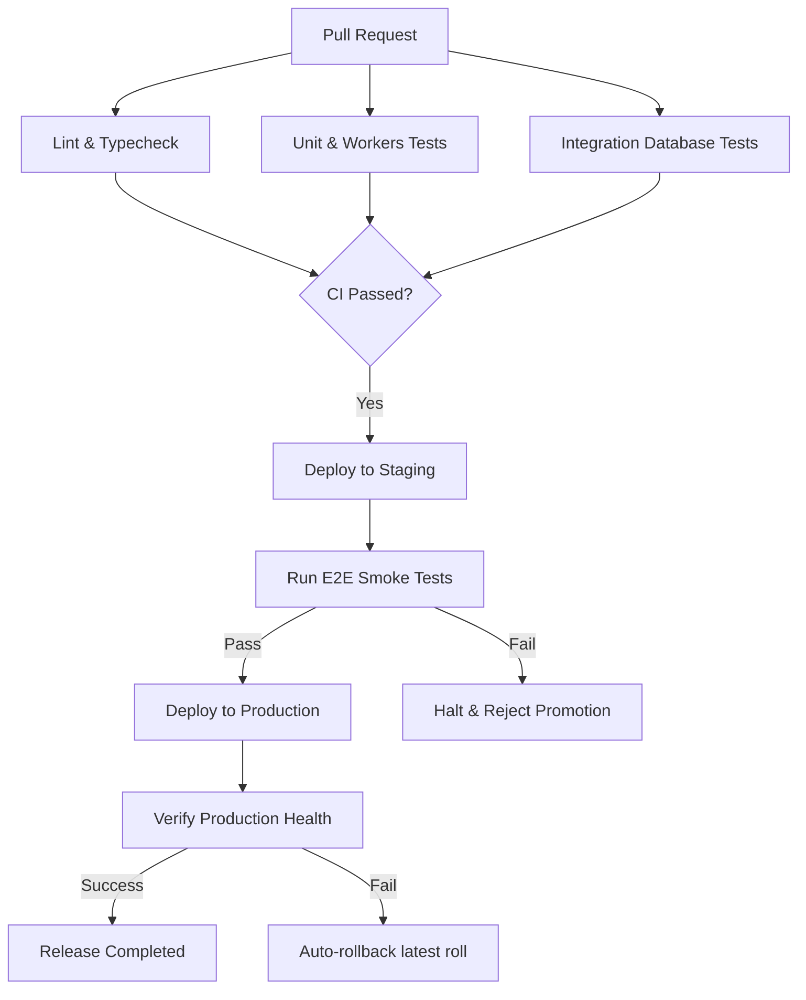

# CI/CD Deployment Architecture & Environment Promotion

This document specifies the pipeline progression and quality gates that control code promotions across environments.

## Deployment Progression

## Promotion Rules
1. **GitHub Actions green check**: 100% successful runs are mandatory on all main integration jobs.
2. **Codecov Threshold**: High-priority modules (such as `packages/billing` and `packages/monitoring/src/judge.ts`) enforce a **95%** coverage requirement. Other folders must keep at least an **80%** baseline.
3. **Manual Production Sign-off**: Human admin approval is required to promote staging builds to live systems.
